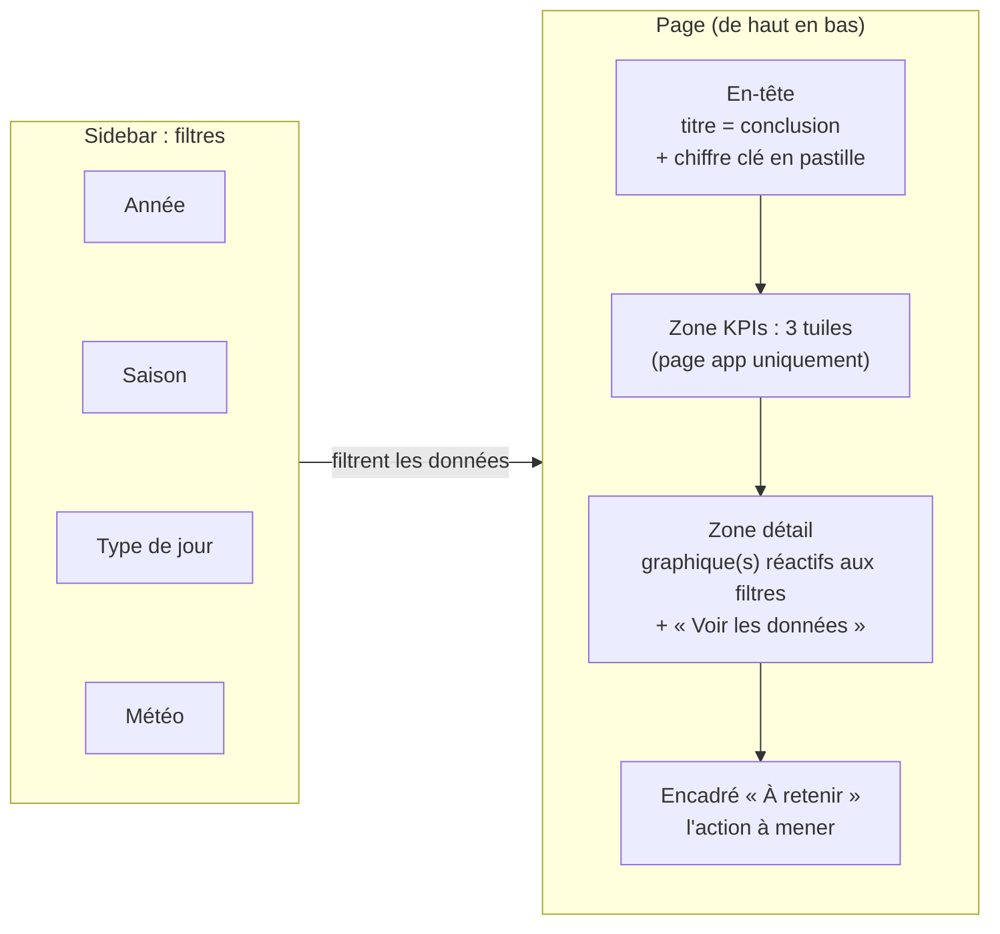
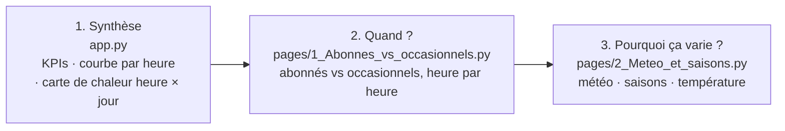

# Cadrage : Vélo Pulse, dashboard des vélos en libre-service

## Message clé (une phrase)
**La demande suit les trajets domicile-travail : en semaine, deux pics (8h et 17h) concentrent les locations, et la pluie les fait chuter de 42 %. Il faut donc remettre des vélos en place avant 7h et avant 16h, et adapter les équipes à la météo.**

## Audience cible
**Le responsable des opérations** du service de vélos en libre-service. Son travail consiste à décider *quand* rééquilibrer les stations et *combien* de personnes mobiliser. Il n'est pas statisticien et a besoin d'un chiffre et d'une action, pas d'une analyse.

## KPIs retenus (3)
Valeurs affichées sans filtre, tous jours confondus. Elles se recalculent à chaque changement de filtre.

| KPI | Contexte affiché | Actionnable ou vanity ? |
|---|---|---|
| **Heure de pointe** (17h, 469 locations/h) | ×2,5 la moyenne horaire | **Actionnable** : indique l'heure à laquelle les vélos doivent déjà être en place. |
| **Effet de la pluie** (−42 %) | 119 locations/h sous la pluie contre 205 par temps clair | **Actionnable** : permet de réduire ou renforcer les tournées à partir de la prévision météo. |
| **Part des abonnés** (81 %) | 80 % en 2011 → 82 % en 2012 | **Actionnable** : une demande faite d'usagers réguliers est prévisible, donc planifiable. |

Les pics de 8h (480 locations/h) et 17h (529 locations/h) du message clé sont calculés sur les **jours ouvrés** seulement, d'où des valeurs plus élevées que le KPI.

**Écarté :** le *nombre total de locations* (≈ 2 millions). Ce chiffre impressionne, mais aucune décision ne peut en découler : c'est une **vanity metric**.

## Structure prévue

### Mise en page
Les 4 filtres de la sidebar s'appliquent à toutes les zones et sont conservés d'une page à l'autre. La zone KPIs n'existe que sur la page `app` ; les deux autres pages vont directement au détail.

### Les trois pages
Trois pages (dossier `pages/`) qui racontent une histoire, de la conclusion vers ses explications :

## Choix des graphiques
| Page | Graphique | Pourquoi ce type |
|---|---|---|
| app | Courbe : locations par heure, jour ouvré vs week-end | Une évolution sur 24 h se lit en ligne ; les 2 pics sautent aux yeux. |
| app | Carte de chaleur : heure × jour de la semaine | Croise deux dimensions (168 cases) ; le foncé montre que les pics se répètent chaque jour ouvré. |
| Abonnes vs occasionnels | Deux courbes sur un même axe | Compare deux profils horaires sans double axe trompeur. |
| Meteo et saisons | Barres horizontales par météo | Compare 3 catégories ; les libellés restent lisibles. |
| Meteo et saisons | Colonnes par saison | 4 périodes dans l'ordre de l'année. |
| Meteo et saisons | Colonnes par tranche de 5 °C | Remplace un nuage de 10 000 points illisible ; l'ordre croissant montre l'effet de la chaleur. |

## Choix de conception marquants (pour le pitch)
1. **Le titre donne la conclusion (Minto)** et se recalcule avec les filtres. Par exemple, avec le filtre « week-end », il devient « la demande culmine vers 13h ».
2. **Une couleur = une signification** sur tout le dashboard : bleu = la demande, vert = abonnés, orange = occasionnels. Ce qui porte le message est en couleur vive, le contexte dans la même teinte en pâle : l'œil voit le point important en moins de 5 secondes. La palette a été vérifiée pour les daltoniens.
3. **Honnêteté** : axes à partir de 0, moyennes par heure plutôt que totaux, orages (1 seule heure) regroupés avec la pluie, saisons nommées par leurs mois (la « saison 1 » du fichier couvre janvier à mars), et effet de la pluie revérifié **à saison et heure égales** (−43 %).

## Choix techniques
- **`@st.cache_data`** : le CSV n'est lu qu'une fois, pas à chaque clic sur un filtre.
- **4 filtres** dans la sidebar (année, saison, type de jour, météo), conservés entre les pages grâce à `st.session_state`.
- **Multi-pages** avec le dossier `pages/` ; le fichier à lancer est `app.py` (`streamlit run app.py`).

## Limites des données
- Jeu Kaggle *Bike Sharing Demand* (Capital Bikeshare, **Washington DC**, 2011-2012), et non Vélib Paris.
- Seuls les **jours 1 à 19 de chaque mois** sont présents (le reste servait de jeu de test sur Kaggle).
- Pas de données par station : le dashboard indique *quand* rééquilibrer, pas *où*.
